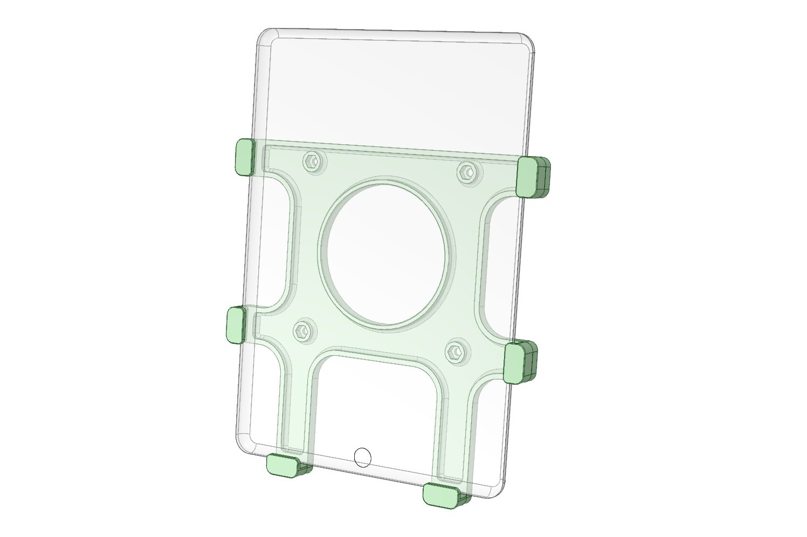
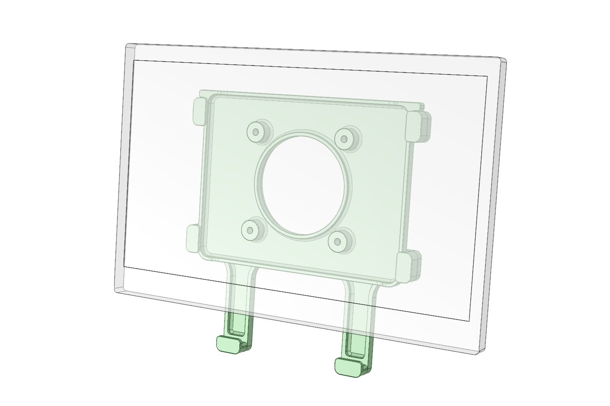

# VESA mount for iPad
iPad mount  
  
Monitor mount  

## Feature
- Compatible with VESA 100mm monitor arm.
- Fits 7th generation or later iPads.
- Holds iPad in portrait or landscape orientation.
- The iPad is held in place simply by inserting it into the slit, eliminating the hassle of clip-on/off.
- The adapter(MonitorAdapter.stl) can be attached to 75mm VESA-mount display monitor and held by plugging it into the slit in the same way as the iPad.
- The monitor adapter is compatible with displays of about 13~14 inches with a 75mm VESA mount.
- By replacing the standard clip with a magnetic clip(MagnetClip.stl), various accessories can be attached.
- Includes an adapter to mount the Logi C270n USB camera on a magnetic clip(C270nAdapter.stl).

## Parts Printing
- Layer height 0.2mm, Extrusion width 0.4mm, Wall count 4, Top/Bottom layers 8, Infill 40%.
- All parts do not require support.
- There are two types of base plates, one for embedded nuts(BasePlateN.stl) and the other for bolt holes(BasePlateH.stl), to suit your preference.

## BOM
- M4 x 10mm SHCS x4
- M4 x 10~12mm SHCS x4 (for Display adapter)
- M4 Nut x4
- M3 x 12mm SHCS x12
- M3 Insert Nut x12
- 3mm x 9mm Stenless steel pin (for C270n Magnet adapter)
- 6mm x 3mm Round Neodymium Magnets x2 (for C270n Magnet adapter)
